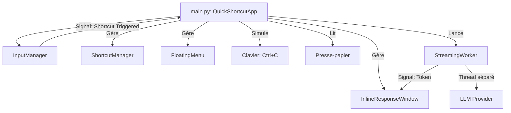

# Architecture Technique - Quick Shortcut AI

Ce document explique la structure du programme et les interactions entre les différents composants pour clarifier le fonctionnement global et les récentes évolutions.

## Vue d'Ensemble des Composants

L'application suit une architecture pilotée par les événements (Event-Driven) centrée sur un orchestrateur principal.

## Description des Rôles

| Composant | Rôle |
| :--- | :--- |
| **QuickShortcutApp** | L'orchestrateur. Il initialise tout, connecte les signaux et gère la logique de haut niveau (capture, routing des actions). |
| **InputManager** | Un hook bas niveau (via `pynput`). Il tourne dans son propre thread pour ne pas figer l'ordinateur et détecte les combinaisons Ctrl + Clic. |
| **StreamingWorker** | Un ouvrier asynchrone qui communique avec l'IA. Il évite que l'interface ne "gèle" pendant que l'IA réfléchit. |
| **InlineResponseWindow** | La nouvelle fenêtre moderne qui affiche la réponse de l'IA à côté de votre curseur. |

## Séquence d'une Action (ex: Summarize)

Voici ce qui se passe exactement quand vous utilisez le raccourci :

```mermaid
sequenceDiagram
    participant User as Utilisateur
    participant IM as InputManager (Hook)
    participant App as QuickShortcutApp
    participant Kbd as Système (Clavier)
    participant Work as StreamingWorker (Thread)
    participant UI as InlineWindow

    User->>IM: Ctrl + Shift + Clic Droit
    IM->>App: Signal: trigger('summarize')
    
    rect rgb(40, 40, 40)
    Note over App, Kbd: Phase de Capture Automatique
    App->>Kbd: Simule Ctrl + C
    App->>App: Attend 400ms (Sync clipboard)
    App->>App: Lit le Presse-papier
    end

    App->>UI: show_at_cursor()
    App->>Work: start(provider, context_text)
    
    loop Streaming des Tokens
        Work->>UI: Signal: append_token(mot)
        UI->>UI: Auto-resize & Affichage
    end
    
    Work->>UI: Signal: finished()
    UI->>UI: Démarre Timer Auto-Hide (10s)
```

## Pourquoi certaines modifications ont semblé "briser" des choses ?

Le passage à la **Version 2 (Modern UX)** a nécessité deux changements majeurs qui peuvent paraître complexes :

1.  **Threaded Streaming** : Pour éviter que Windows ne dise "L'application ne répond pas" pendant que l'IA génère du texte, nous avons dû déplacer la communication avec l'IA dans un [StreamingWorker](file:///d:/MGS/DEV/app-quick-shortcut-AI-LLM/src/main.py#47-78). Cela a introduit des enjeux de synchronisation (signaux).
2.  **Gestion des Objets C++ (Qt)** : PySide6 est une surcouche de C++. Si on tente d'accéder à un objet (comme un Thread) qui a fini son travail et s'est auto-détruit, cela cause un crash. C'est pourquoi j'ai ajouté des vérifications de sécurité (`try...except` et `isRunning()`).
3.  **Encodage Windows** : Le crash "UnicodeEncodeError" arrivait parce que Windows (en français) utilise parfois un encodage (cp1252) qui ne supportait pas les symboles "✓" ou "❌" dans les fichiers de logs. Je les ai remplacés par `[OK]` et `[ERR]`.

Ces changements visent à rendre le programme **robuste et professionnel** plutôt qu'un simple script de test.
